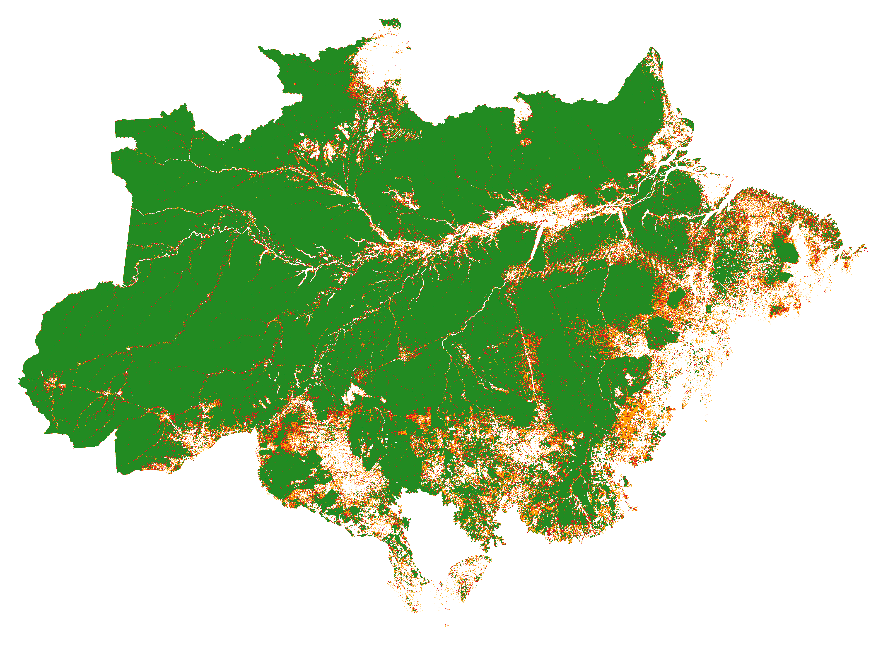

# Create Forest Cover Change Map

The following script can be used to download, process and obtain maps of forest cover change (FCC) for the years 2000-2022 in the format of `fcc_123` where:
 - 0 stands for no forest cover at the beginning of the first time period (set as No Data Value)
 - 1 stands for deforestation in the first time period
 - 2 stands for deforestation in the second time period
 - 3 stands for remaining forest cover

We employ this as the input to the [riskmapjnr](https://github.com/ghislainv/riskmapjnr) package to obtain the risk map of deforestation. 



## Usage

The scripts require the following input parameters which should be passed:
- `start_year` : Start year of the time period
- `mid_year` : Mid year of the time period
- `end_year` : End year of the time period
- `defor_dir` : Directory where the deforestation masks are stored with names `merged_map_defor-mask_${year}.tif`
- `lossyear_map` : Path to the forest loss year map, generated by `preprocess.sh`
- `forestcover_map` : Path to the forest cover map for the year 1 greater than the `end_year`
- `out_dir`: Output directory where you want to store the results

The folder contains two scripts, `preprocess.sh` and `create_fcc.sh`. 

- `preprocess.sh` : This script will require deforestation masks of the years under consideration (stored in `defor_dir`) for the area of interest and output the final map for forest loss year. The required output will be stored as `${output_dir}/forest-loss-year_map_$((start_year-2000))-$((end_year-2000)).tif`. To run this, simply perform:

  ```bash
  ./preprocess.sh <start_year> <end_year> <defor_dir> <out_dir>
  ```

- `create_fcc.sh` : This script will create the final FCC map for the given time period. Using this, one can create multiple FCC maps for any time period that they may require as the processing has already been done by the above script. To run this, simply perform:

  ```bash
  ./create_fcc.sh <lossyear_map> <forestcover_map> <start_year> <mid_year> <end_year> <out_dir>
  ```

The required output will be stored as `$out_dir/merged_map_fcc-123_$((start_year-2000))-$((end_year-2000)).tif`

## Points to note

- Both the scripts require moderate amount of compute, depending on the size of the input and will take about an hour to run on the whole of Brazil, using about 24 GB of memory on a single CPU. Hence, it might be better to schedule it on a cluster. The job file for the same has also been provided and can be run as follows:

  ```bash
  sbatch job.exp
  ```
- You can have different values of `start_year` and `end_year` for the two scripts. The `start_year` and `end_year` in `preprocess.sh` generated the forest loss year map for the given time period. Using this map, one can generate the `fcc_123` map for any subset of the above time period. Hence, the `start_year` and `end_year` in `create_fcc.sh` will generate the FCC map for the given time segment. Thus, after the preprocessing has been performed, you can create the FCC maps for any time period by simply running `create_fcc.sh` with the required parameters. This will be much faster than running the whole script again.

## References

The scripts mainly utilise the [`GDAL`](https://gdal.org/) library.
