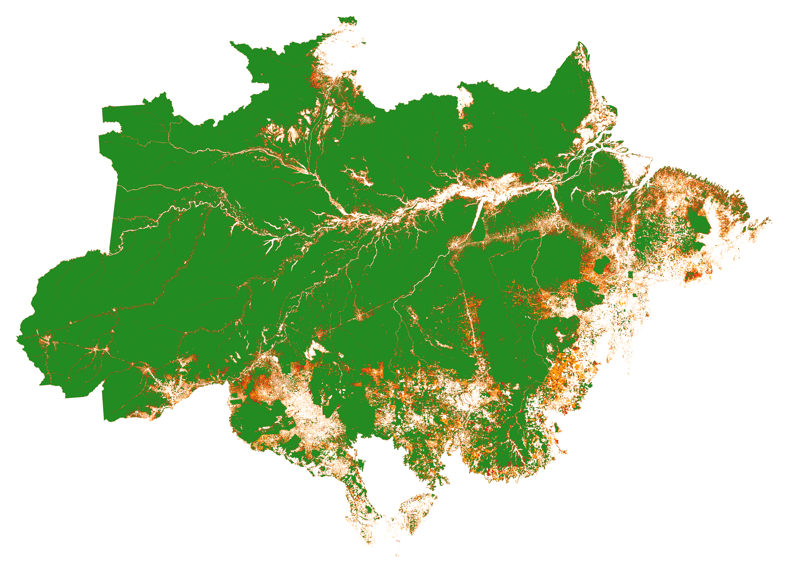

# Generate JNR Risk Map

The following script can be used to obtain maps of the spatial risk of deforestation and forest degradation following the methodology developed in the context of the Jurisdictional and Nested REDD+ ([JNR](https://verra.org/project/jurisdictional-and-nested-redd-framework/)) and using only a forest cover change map as input.



## Usage

In the `jnr.py` script, set the parameters and specify the output directory where you want to store the results as well as the input file. The input file format is `fcc_123` (stands for Forest Cover Change) which is a raster file of past deforestation. It has the following format:
- 1 stands for deforestation in the first time period
- 2 stands for deforestation in the second time period
- 3 stands for remaining forest cover

We use utilise the `fcc_123` map from the previous scripts, stored as `$out_dir/merged_map_fcc-123_$((start_year-2000))-$((end_year-2000)).tif`.

Simply run the script as follows:

```bash
python3 jnr.py --output-dir <path-to-output-dir> --fcc-file <path-to-fcc-file> 
```

which will output the riskmap.


The output directory will have several folders, but the files of interest include 
- `<output_dir>/fullhist/riskmap_ws<window-size>_<binning-strategy>.tif` which is the final risk map with the selected parameters on the full history
- `<output_dir>/fullhist/defrate_per_cat_ws<window-size>_<binning-strategy>.csv` which is the deforestation rate per category
Using these files, one can calculate the prediction of deforestation in terms of hectares of deforestation.

## Points to note

- The script requires a lot of compute and will take about 20 hours on a high memory node on a single CPU if you're running for the whole of Brazil. Hence, it is better to schedule it on a cluster. The job file for the same has also been provided and can be run as follows:

  ```bash
  sbatch job.exp
  ```
- Don't use the `parallel` argument in `rmj.makemap` function. It is not working as expected and will give you wrong results.
- The script will create a lot of intermediate files. You can delete them once the script has finished running. Don't utilise the clean `argument` in `rmj.makemap` function. The code gives an error when you use it, which is because the parent directory isn't specified.

## References

The scripts mainly utilise the [`riskmapjnr`](https://github.com/ghislainv/riskmapjnr) package.
