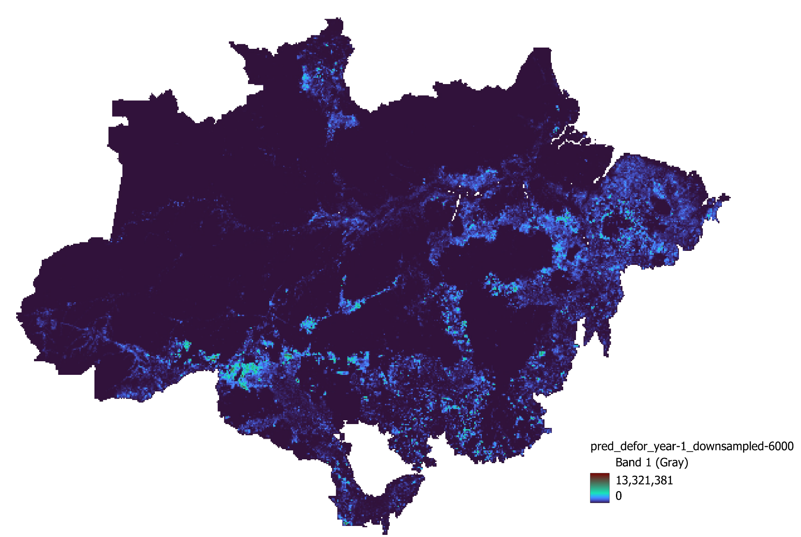

# Generate JNR Risk Map

The following scripts can be used to obtain deforestation prediction maps following the methodology developed in the context of the Jurisdictional and Nested REDD+ ([JNR](https://verra.org/project/jurisdictional-and-nested-redd-framework/)) and using only a forest cover change map as input.

## Requirements

You will need several dependencies to run the script. The best way to install all the requirements is to create a Python (`>=3.6`) virtual environment.

```bash
# Create virtual environment
python3 -m venv jnr_env
source jnr_env/bin/activate

# Install numpy
pip install numpy==1.20.3
# Install GDAL (tested with 3.3.0)
pip install --global-option=build_ext --global-option="-I/usr/include/gdal" gdal==$(gdal-config --version)
# Install riskmapjnr which all install all other dependencies
pip install riskmapjnr==1.2
```

**Note:** If you're working on Avon, you can simply load the GDAL module. In this case, one doesn't need to install GDAL.

## Usage

We divide the process into three steps:
1. [Creating Input Files](#1-creating-input-files)
2. [Creating Risk Maps](#2-creating-risk-maps)
3. [Creating Deforestation Prediction and Ground Truth Maps](#3-creating-deforestation-prediction-and-ground-truth-maps)

### 1. Creating Input Files

In order to run the JNR algorithm, we need to have the input file in `fcc_123` (stands for Forest Cover Change) format. This is a raster file of past deforestation and has the following format:
- 0 stands for no forest cover at the beginning of the first time period (set as No Data Value)
- 1 stands for deforestation in the first time period
- 2 stands for deforestation in the second time period
- 3 stands for remaining forest cover

The scripts to generate the same can be found in the [1. Create Input](./1.%20Create%20Input/) folder. Simply run the script as follows:

```bash
./preprocess.sh <start_year> <end_year> <defor_dir> <out_dir>
./create_fcc123.sh <lossyear_map> <forestcover_map> <start_year> <mid_year> <end_year> <out_dir>
```

It will generate the `fcc_123` file in the output directory. An example can be seen below:


### 2. Creating Risk Maps

The next step is to create the risk maps using the Jurisdictional and Nested REDD+ ([JNR](https://verra.org/project/jurisdictional-and-nested-redd-framework/)). The scripts to generate the same can be found in the [2. Create Risk Maps](./2.%20Run%20JNR/) folder. Simply run the script as follows:

```bash
python3 jnr.py --output-dir <path-to-output-dir> --fcc-file <path-to-fcc-file>
```

It will generate the risk maps as well as the rate of deforestation for each category of risk. An example can be seen below:


### 3. Creating Deforestation Prediction and Ground Truth Maps

The final step is to create the deforestation prediction and ground truth maps using outputs from the JNR benchmark and the deforestation masks.. The scripts to generate the same can be found in the [3. Create Output](./3.%20Create%20Output/) folder. Simply run the script as follows:

```bash
./create_pred.sh <csv_file> <raster_file> <out_dir> <num_year> <downsample_size>
./create_gt.sh <year> <defor_map> <out_dir> <downsample_size>
```

It will generate the deforestation prediction and ground truth maps. An example of the deforestation prediction map downsampled at 6000m can be seen below:



## References

The script mainly utilises the [`riskmapjnr`](https://github.com/ghislainv/riskmapjnr) package and the [`GDAL`](https://gdal.org/) library.
