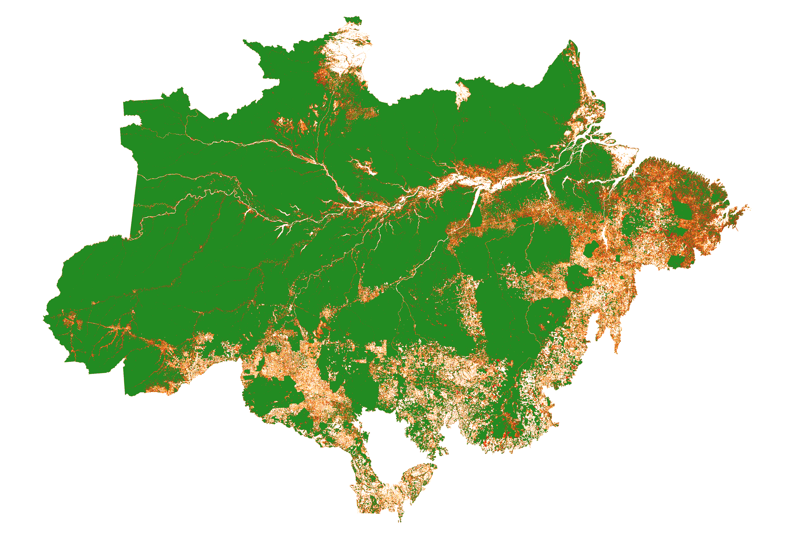

# Create Forest Cover Change Map

The following script can be used to download, process and obtains map of forest cover change (FCC) for the years 2000-2022 in the format of `fcc_123` where:
 - 1 stands for deforestation in the first time period
 - 2 stands for deforestation in the second time period
 - 3 stands for remaining forest cover

We employ this as the input to the [riskmapjnr](https://github.com/ghislainv/riskmapjnr) package to obtain the risk map of deforestation. 



## Requirements

You will `GDAL` (tested with 3.3.0) to run the script. You can install it as follows:

```bash
pip install --global-option=build_ext --global-option="-I/usr/include/gdal" gdal==$(gdal-config --version)
```

**Note:** If you're working on Avon, you can simply load the GDAL module. In this case, one doesn't need to install GDAL.

## Usage

The script requires the following input parameters which should be passed in order to the bash script `run.sh`:
- `out_dir`: Output directory where you want to store the results
- `shp_file` : Shapefile of the region of interest
- `start_year` : Start year of the time period; it should be the first two digits of the year, e.g. 17 for 2017
- `mid_year` : Mid year of the time period; it should be the same format as `start_year`
- `end_year` : End year of the time period; it should be the same format as `start_year`
- `nodata_val` : No data value for the raster file, you can set it to 23 or any other value >= 23

Now, one can simply run the script as follows:

```bash
sh run.sh <out_dir> <shp_file> <start_year> <mid_year> <end_year> <nodata_val>
```

The output directory will have several folders:

```
out_dir
├── downloaded_tiles
│   ├── lossyear
│   └── treecover2000
└── merged_maps
```

The `downloaded_tiles` folder will have the downloaded tiles from the [Global Forest Change](https://storage.googleapis.com/earthenginepartners-hansen/GFC-2022-v1.10/download.html) website. The `merged_maps` folder will have the merged maps for forest loss year and tree cover. The required output will be stored as 
```${out_dir}/merged_maps/merged_map_fcc-123_${start_year}-${end_year}.tif```

## Points to note

- The script requires significant compute, depending on the size of the input. Running it on whole of Brazil required about 24 GB of memory, taking about 4 to 6 hours on a single CPU. Hence, it is better to schedule it on a cluster. The job file for the same has also been provided and can be run as follows:

  ```bash
  sbatch job.exp
  ```
- The script will create a lot of intermediate files, mainly after clipping the region of interest and after projecting it to required systems. You can delete them once the script has finished running.

## References

The script mainly utilises the [`GDAL`](https://gdal.org/) library and the raster data of forest cover loss and tree cover of Brazil from [Global Forest Change](https://storage.googleapis.com/earthenginepartners-hansen/GFC-2022-v1.10/download.html) dataset.